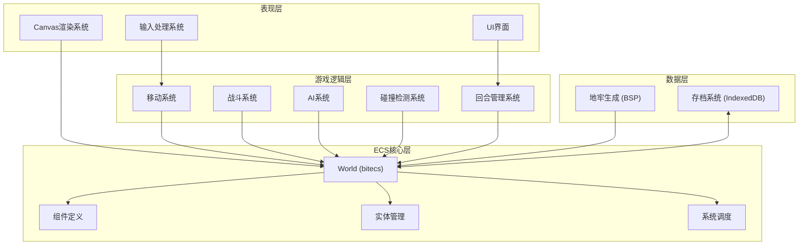

## 1. 架构设计



## 2. 技术描述

- **前端框架**：原生JavaScript + bitecs (ECS库)
- **构建工具**：Vite 5.x
- **渲染技术**：HTML5 Canvas 2D API
- **数据存储**：IndexedDB (idb库封装)
- **ECS库**：bitecs ^0.3.40 (高性能TypeScript ECS库)
- **字体**：Google Fonts - Press Start 2P, VT323

### 核心依赖

```json
{
  "bitecs": "^0.3.40",
  "idb": "^8.0.0"
}
```

## 3. 目录结构

```
src/
├── ecs/
│   ├── components.js     # 组件定义 (Position, Renderable, Health, Combat, AI, etc.)
│   ├── world.js          # ECS世界创建和管理
│   └── systems/
│       ├── movement.js   # 移动系统
│       ├── combat.js     # 战斗系统
│       ├── ai.js         # AI系统（行为树）
│       ├── collision.js  # 碰撞检测系统
│       └── render.js     # Canvas渲染系统
├── dungeon/
│   ├── bsp.js            # BSP地牢生成算法
│   └── generator.js      # 地牢生成器
├── save/
│   └── indexeddb.js      # IndexedDB存档系统
├── ui/
│   ├── hud.js            # 状态栏UI
│   ├── messageLog.js     # 消息日志
│   └── controls.js       # 控制按钮
├── game/
│   ├── loop.js           # 游戏主循环
│   ├── input.js          # 输入处理
│   └── turnManager.js    # 回合管理器
├── entities/
│   ├── player.js         # 玩家实体创建
│   ├── monster.js        # 怪物实体创建
│   └── items.js          # 宝箱、陷阱等实体
├── constants/
│   └── gameConfig.js     # 游戏配置常量
├── main.js               # 入口文件
└── style.css             # 全局样式
```

## 4. 核心数据模型

### 4.1 组件定义

```javascript
// Position 组件 - 存储实体位置
const Position = {
  x: Types.ui8,
  y: Types.ui8
};

// Renderable 组件 - 存储渲染信息
const Renderable = {
  emoji: Types.ui8, // emoji索引
  color: Types.ui32, // 颜色值
  visible: Types.ui8
};

// Health 组件 - 存储生命值
const Health = {
  current: Types.ui8,
  max: Types.ui8
};

// Combat 组件 - 存储战斗属性
const Combat = {
  attack: Types.ui8,
  defense: Types.ui8
};

// AI 组件 - 存储AI状态
const AI = {
  type: Types.ui8, // 0: 巡逻, 1: 追击, 2: 逃跑
  state: Types.ui8, // AI状态机
  targetEid: Types.eid // 目标实体ID
};

// Player 标签组件
const Player = defineComponent();

// Monster 标签组件
const Monster = defineComponent();

// Chest 标签组件
const Chest = defineComponent();

// Trap 标签组件
const Trap = defineComponent();

// Stairs 标签组件
const Stairs = defineComponent();

// Wall 标签组件
const Wall = defineComponent();
```

### 4.2 存档数据结构

```javascript
// 存档数据结构
interface SaveData {
  version: string;
  timestamp: number;
  floor: number;
  turn: number;
  worldState: {
    entities: Array<{
      id: number;
      components: {
        Position?: { x: number; y: number };
        Renderable?: { emoji: number; color: number; visible: number };
        Health?: { current: number; max: number };
        Combat?: { attack: number; defense: number };
        AI?: { type: number; state: number; targetEid: number };
        tags: string[]; // ['Player', 'Monster', etc.]
      };
    }>;
    map: number[][]; // 10x10 地图数据
  };
}
```

## 5. 系统执行顺序

每回合系统执行顺序：

1. **输入系统** - 处理玩家输入，生成移动意图
2. **碰撞检测系统** - 检测移动是否合法
3. **移动系统** - 执行玩家移动
4. **战斗系统** - 处理玩家攻击
5. **事件系统** - 处理宝箱、陷阱、楼梯触发
6. **AI系统** - 怪物思考，生成行动意图
7. **碰撞检测系统** - 检测怪物移动是否合法
8. **移动系统** - 执行怪物移动
9. **战斗系统** - 处理怪物攻击
10. **渲染系统** - 渲染最新状态
11. **回合管理** - 切换回合，更新UI

## 6. IndexedDB Schema

```javascript
// 数据库配置
const DB_CONFIG = {
  name: 'RoguelikeGameDB',
  version: 1,
  stores: {
    saves: {
      keyPath: 'id',
      autoIncrement: true,
      indexes: [
        { name: 'timestamp', keyPath: 'timestamp', unique: false },
        { name: 'floor', keyPath: 'floor', unique: false }
      ]
    }
  }
};
```
