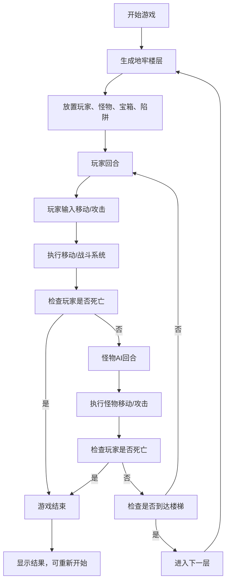
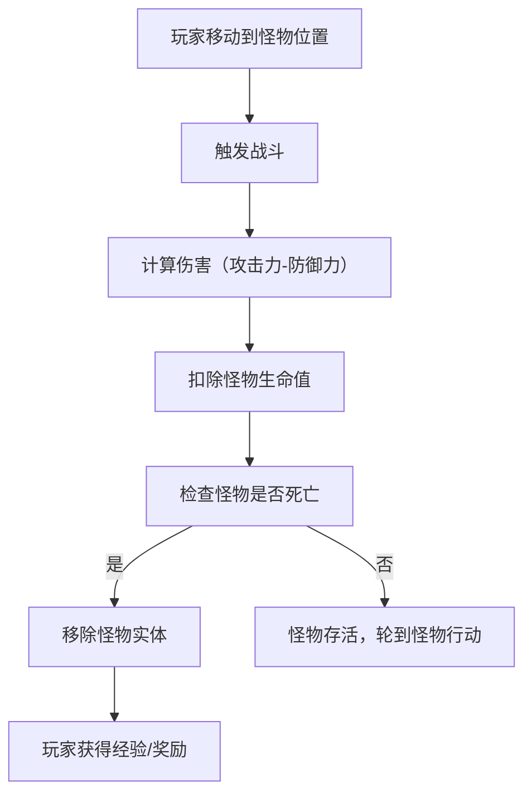

## 1. 产品概述

本项目是一款基于浏览器的Roguelike地牢探索游戏，采用ECS（实体-组件-系统）架构开发。玩家控制英雄在随机生成的地牢中探索，与怪物战斗，收集宝箱，躲避陷阱。游戏具有高度的可重玩性，每次进入新楼层都会生成全新的地图布局。

- **核心玩法**：回合制网格移动地牢探索，玩家与怪物交替行动
- **目标用户**：喜欢Roguelike、策略游戏的休闲和核心玩家
- **产品价值**：提供轻量级、高重玩性的浏览器游戏体验，无需下载即可游玩

## 2. 核心功能

### 2.1 功能模块

1. **地牢生成系统**：基于BSP算法的随机地图生成，10x10网格地图
2. **ECS核心系统**：实体管理、组件注册、系统调度
3. **移动系统**：网格移动、碰撞检测、回合制逻辑
4. **战斗系统**：近战攻击、伤害计算、生命值管理
5. **AI系统**：怪物行为树（巡逻、追击、攻击）
6. **渲染系统**：Canvas 2D渲染地图、实体、UI
7. **存档系统**：IndexedDB存储游戏进度
8. **输入系统**：键盘控制（方向键/WASD移动）

### 2.2 页面详情

| 页面名称 | 模块名称 | 功能描述 |
|---------|---------|---------|
| 游戏主界面 | Canvas渲染区 | 10x10地牢地图、英雄、怪物、宝箱、陷阱可视化 |
| 游戏主界面 | 状态栏 | 显示生命值、当前楼层、回合数、操作提示 |
| 游戏主界面 | 操作按钮 | 新游戏、保存、加载、下一层 |
| 游戏主界面 | 消息日志 | 显示战斗、移动、事件等游戏信息 |

## 3. 核心流程

### 3.1 游戏主流程

### 3.2 战斗流程

## 4. 用户界面设计

### 4.1 设计风格

- **主色调**：深紫色 (#2d1b4e) 作为背景主色，营造地牢神秘氛围
- **强调色**：金色 (#ffd700) 用于UI边框和重要信息，红色 (#ff4757) 用于危险/生命值，绿色 (#2ed573) 用于治疗/增益
- **字体**：使用像素风格字体"Press Start 2P"搭配"VT323"等宽字体，营造复古游戏感
- **按钮风格**：像素风边框，悬停时有轻微放大和发光效果
- **布局风格**：左侧游戏画布，右侧状态栏和控制面板，底部消息日志
- **图标风格**：使用emoji和简单几何图形代表游戏实体（👤英雄、👹怪物、📦宝箱、⚠️陷阱、🚪楼梯）

### 4.2 页面设计概述

| 页面名称 | 模块名称 | UI元素 |
|---------|---------|---------|
| 游戏主界面 | Canvas游戏区 | 800x800像素画布，10x10网格，每个格子80x80像素，地牢墙壁深灰色，地板浅灰色 |
| 游戏主界面 | 状态栏面板 | 深色半透明背景，金色边框，显示❤️生命值、🏰楼层、⏱️回合数 |
| 游戏主界面 | 控制按钮区 | 排列整齐的像素风格按钮：新游戏、保存、加载、下一层 |
| 游戏主界面 | 消息日志 | 深色半透明背景，滚动显示最近10条游戏消息，不同类型消息不同颜色 |

### 4.3 响应性

- 采用桌面优先设计，最小支持宽度1200px
- 游戏画布固定800x800像素，居中显示
- 侧边栏采用固定宽度280px
- 不针对移动端优化，专注桌面浏览器体验
